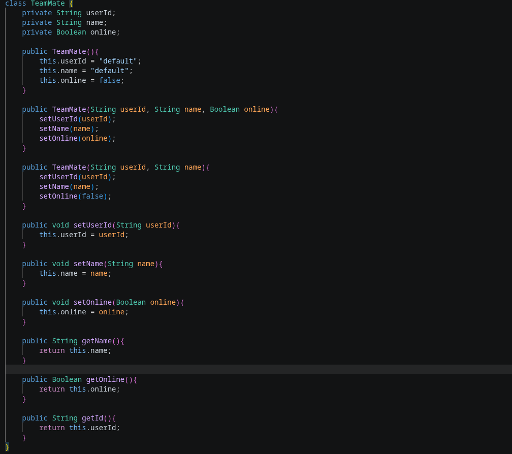
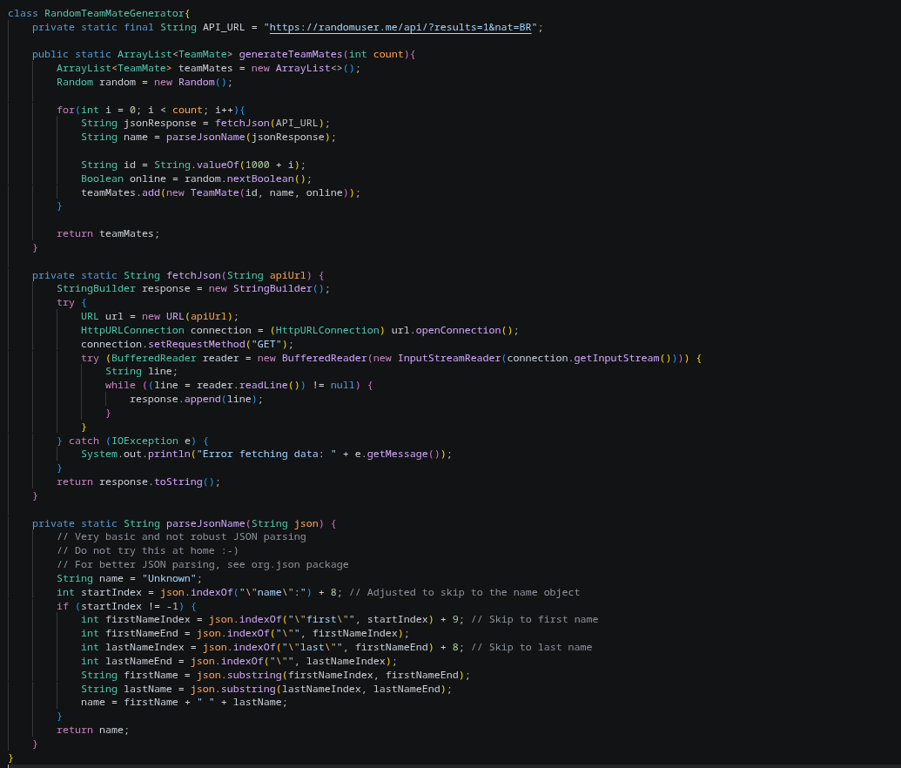
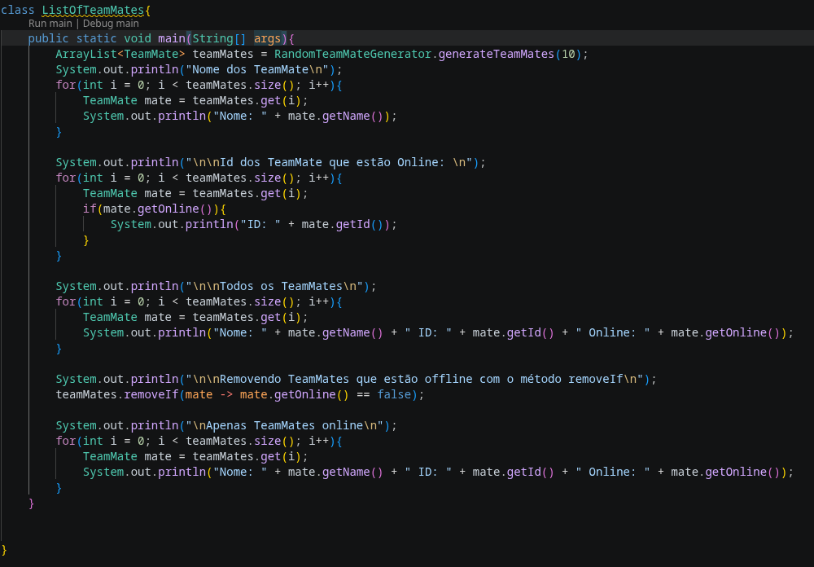
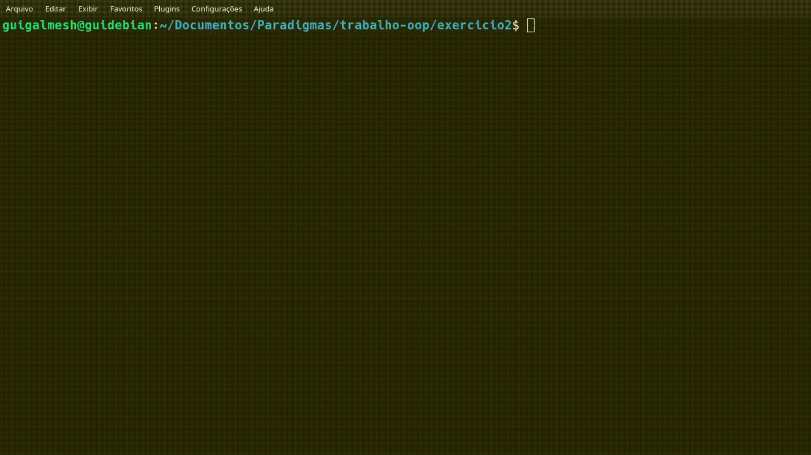
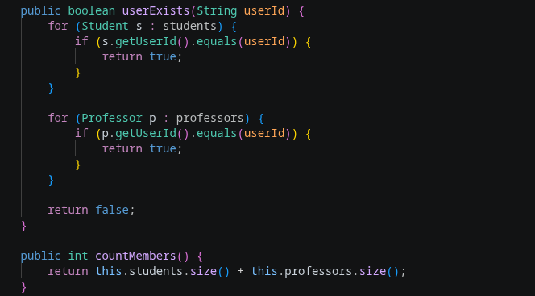

# apresentacao-bim2-2026a-guigalmesh

### Exercicio 2:

#### Classe TeamMate

#### Classe para gerar os TeamMates

#### Classe com a main para listar os TeamMates

#### Execução do programa

### Exercicio 3:

#### Funções que eram pra ser completadas

#### Execução do programa

#### Perguntas do Exercicio

##### 1. Você consegue identificar alguma redundância nos códigos?
As classes `Student` e `Professor` possuem atributos idênticos, `name` e `userId`.
Também usam os mesmos métodos para acessar e modificar esses dados.

#### 2. O que aconteceria se fosse necessário armazenar outros atributos (CPF, data de nascimento, telefone, etc.)?
Teríamos que declarar essas váriaveis e criar seus respectiovs getter e setter duas vezes, na classe `Student` e `Professor`.
Isso é algo que deixa a manutenção no código muito ruim.

#### 3. O que aconteceria na classe Group se tivéssemos outras categorias de membros(técnicos, adminisitradores)?
A classe `Group` precisaria ser constantemente reescrita e modificada.
Por exemplo, para os técnicos:
Teria que criar uma terceira lista.
Criar um terceiro método de adição.
Adicionar um terceiro laço em outros métodos.
Teria que alterar `countMembers()` para somar a nova lista.
